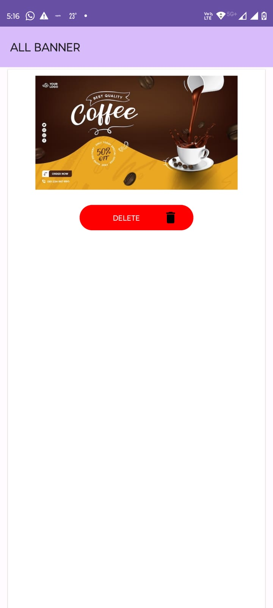
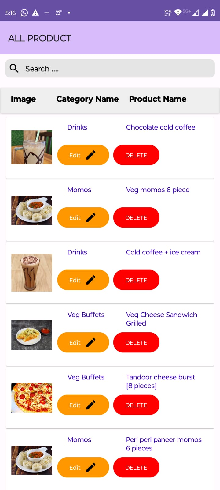
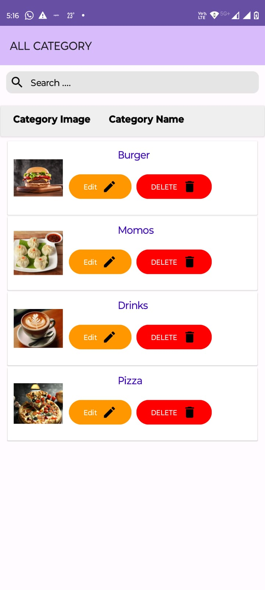

# ☕ Cafe Management Android App – Admin Panel

This repository contains the **Admin Panel** of a Cafe Management System built using Android (Java) and Firebase. The app allows cafe owners or staff to manage products, view orders, and control system functionalities in real time.

## 📱 Features

- 🔐 Admin Login & Authentication
- 📦 Add, Edit, Delete Products
- 🛒 View and Manage Customer Orders
- 📊 Real-Time Order Tracking with Firebase
- 📂 Categorized Product Listings
- 📥 Order History & Management
- 📤 Firebase Cloud Storage for product images

## 🚀 Tech Stack

- **Language:** Java
- **Backend:** Firebase (Firestore, Firebase Auth, Storage)
- **IDE:** Android Studio
- **Architecture:** MVVM (optional, based on project structure)

## 📸 Screenshots
<p float="left">
  
  
  
</p>
<p float="left">
  
  
  
</p>
<p float="left">
  
  
  
</p>


## 🛠️ Setup Instructions

1. **Clone the Repository**
   ```bash
   git clone https://github.com/vira250/Cafe-management-android-app-Admin-panel.git
   ```
2. **Open in Android Studio**

`Connect to Firebase`

`Create a new project in Firebase.`

`Add Android app with the package name used in the project.`

`Download google-services.json and place it in the app/ directory.`

`Enable Firebase Firestore, Authentication, and Storage.`

`Build and Run the App`

## ✅ Requirements
Android Studio (latest version)

Firebase account

Android Device/Emulator with minimum SDK level 21
